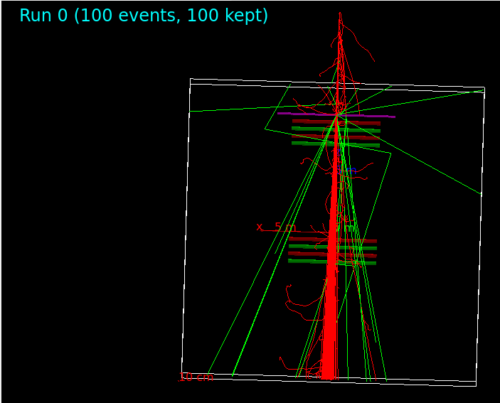

# GEANT4-muonCargo
* This repository is used for uploading the GEANT4 code for the cargo detection project, HK cluster, 2024.
<div align="center">
  
</div>

* The code include:
1. Define a 3D cartesian geometry
2. Rectangular plates aligned parallelly
3. A muon gun to generate muon event(s) at a position
4. Access physics parameters of simulated events and save as ROOT histograms and TTree object (=make NTuple files)

# Latest update
* 12/17/2024: Self-define gas done
  - C2H2F4 94.7%
  - C4H10 5%
  - SF6 0.3%

# GEANT 4 installation and tutorial
* Pre-installation (Linux only):
```sh
sudo apt install cmake cmake-curses-gui gcc g++ libexpat1-dev libxmu-dev libmotif-dev qtbase5-dev qtchooser qt5-qmake qtbase5-dev-tools
```
* Please reflect to the instruction in the german boi series https://www.youtube.com/watch?v=4DTumUo3IKw&t=2s

# Getting start
* Download the code
```sh
git clone https://github.com/Tony1022/GEANT4-muonCargo.git
```
* CMake is required to compile the code
```sh
cd /path/to/GEANT4-muonCargo
mkdir build
cd build
cmake ..
make
```
* Test the code
```sh
./sim
```
If your GEANT4 is installed properly, you will see a UI that have a cartesian coordinate system, a purple plate and parallel plates aligned parallelly in red and green.

# Main scripts
* TCDetectorConstruction.cc: Define detector geometry, materials and gas content
* TCPrimaryGenerator.cc: Setup the particle gun, specify the particle that you want to shoot, its starting point, direction/momentum and initial total energy
* TCRunAction.cc: Initialize the TTree variables and histograms that you want to put into your .root file, manage the open, write and close file
* TCSensitiveDetector.cc: Access the physics variables from the steps of particle pass through the detector
* TCActionInitialization.cc: Initialize the particle gun and ROOT file (and the TTree, histograms) manager
* TCPhysicsList.cc: Initialize the physics that need to be included

# Author list
Tony Kwok Ching Cheung
